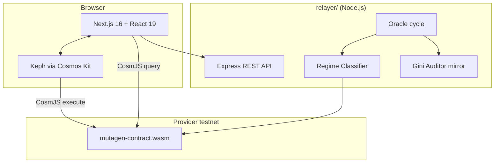

# MUTAGEN

> **A bonding-curve gacha where the loot table is reshaped live by real Cosmos Hub activity — merge Specimens, raid a shared Boss, and trust an onchain fairness auditor.**

Built for the **Mad Easy on Cosmos** builder sprint (Mad Scientists × Cosmos Labs × Odin Scan).

| | |
|---|---|
| **Live demo** | **[https://mutagen-chi.vercel.app](https://mutagen-chi.vercel.app/)** · [deployment.md](./deployment.md) |
| **Chain** | Cosmos ICS Provider testnet (`provider`) |
| **Contract** | `cosmos10drgaq032vgtfrmul6cfwnnlgj7nt3qps6nw07f3wvpyzl4jdx5s7jw4l0` |
| **Architecture diagrams** | [mermaid.md](./mermaid.md) |

---

## Table of contents

1. [What is MUTAGEN?](#what-is-mutagen)
2. [Why Cosmos Hub matters here](#why-cosmos-hub-matters-here)
3. [Core game loop](#core-game-loop)
4. [Architecture](#architecture)
5. [AI components](#ai-components)
6. [Tech stack](#tech-stack)
7. [Repository structure](#repository-structure)
8. [Prerequisites](#prerequisites)
9. [Quick start](#quick-start)
10. [Environment variables](#environment-variables)
11. [Wallet setup (Keplr)](#wallet-setup-keplr)
12. [Running the frontend](#running-the-frontend)
13. [Running the relayer](#running-the-relayer)
14. [CosmWasm contract](#cosmwasm-contract)
15. [Relayer HTTP API](#relayer-http-api)
16. [On-chain contract API](#on-chain-contract-api)
17. [Application pages](#application-pages)
18. [Loot table & regimes](#loot-table--regimes)
19. [Resonance bonus](#resonance-bonus)
20. [Lab animations & sound](#lab-animations--sound)
21. [Verification & testing](#verification--testing)
22. [Deployed testnet manifest](#deployed-testnet-manifest)
23. [Odin Scan parallel](#odin-scan-parallel)
24. [Merge Lab](#merge-lab)
25. [Raid Boss](#raid-boss)
26. [Known limitations](#known-limitations)
27. [Troubleshooting](#troubleshooting)
28. [License](#license)

---

## What is MUTAGEN?

MUTAGEN is a **reflexive gacha + cooperative raid** experiment on Cosmos:

1. **Bond** testnet ATOM into the incubator curve.
2. **Trigger a Mutagen Exposure** — a weighted random pull from a live loot table.
3. **Receive** a Mutation outcome (COMMON → LEGENDARY) with an on-chain payout multiplier.
4. **Watch** the odds shift as real Hub macro signals change the **Volatility Regime Score**.
5. **Trust** the system through a transparent dashboard: payout histogram, Hub Pulse feed, Zero-Sum Index gauge, and append-only Lab Notebook.
6. **Merge** four owned Experiments into a battle-ready **Specimen** with a computed Archetype and Power score.
7. **Raid** a shared on-chain Boss — cooperative damage, regime-sensitive combat, and proportional rewards.

Every pull is logged permanently on-chain as an **Experiment** entry. Specimens and Boss damage are fully on-chain too — *everything is an experiment.*
---

## Why Cosmos Hub matters here

This is not cosmetic chain branding. Hub state **directly rescales** in-game risk:

| Signal | Source | How it is used |
|--------|--------|----------------|
| Bonded-token ratio Δ | `x/staking` pool REST query | Regime Classifier input (33% weight) |
| Governance activity Δ | Active proposals in voting period | Regime Classifier input (33% weight) |
| IBC transfer volume Δ | Tendermint `tx_search` over ~600 blocks | Regime Classifier input (33% weight) |
| Wallet delegation | Native `x/staking` query **inside the contract** | Resonance Bonus at pull time |

The relayer fetches Hub features, computes a **Volatility Regime Score (0–100)**, and submits `update_regime_score` to the CosmWasm contract. The contract rescales tier weights and payout multipliers immediately.

> **Cosmos relevance in one sentence:** Macro Hub conditions reshape gacha odds on-chain; wallet delegation improves your pull weights; every experiment is an auditable chain record.

---

## Core game loop

```text
Connect wallet → Enter bond amount (uatom) → TRIGGER EXPOSURE
    → [1] bond{} tx locks funds as pending bond
    → [2] trigger_exposure{} tx draws tier, pays out, logs experiment
    → UI reveal animation + relayer experiment POST
    → Dashboard / Notebook update from chain + relayer sync

Collect 4 Experiments → MERGE LAB → merge_specimen{} → Specimen NFT
    → Select Specimen → RAID BOSS → attack_boss{} → shared HP pool drops
    → Boss defeated → claim_reward{} proportional to damage share
```

**Two-step exposure flow** (by design):

- `Bond` stores a per-player pending bond (prevents double-spend of the same funds).
- `TriggerExposure` consumes the pending bond, runs the draw, sends payout, appends the experiment ledger entry.

Minimum bond: **0.001 ATOM** (`1_000 uatom`). Default UI amount: **0.1 ATOM**.

---

## Architecture



**Full diagrams** (sequence flows, auditor model, sync hooks, animation timeline): **[mermaid.md](./mermaid.md)**

### Component responsibilities

| Component | Role |
|-----------|------|
| **Frontend** (`src/`) | Wallet UX, Lab pull UI, Merge Lab, Raid Boss, live dashboard, notebook, mutations gallery |
| **Relayer** (`relayer/`) | Hub feature ingestion, Regime Classifier, regime tx submission, REST API for Hub Pulse + off-chain auditor mirror |
| **CosmWasm contract** (`mutagen-contract/`) | Bonding, draws, loot table, auditor, experiment ledger, Specimen merge, Boss raid, native staking bonus query |
| **Deploy manifest** (`public/contract.json`) | Canonical testnet addresses consumed by frontend + scripts |

---

## AI components

Both AI pieces are **load-bearing but bounded** — they fire on schedule or threshold, not as open-ended agents. This is intentional: visible, auditable automation instead of “AI slop.”

### 1. Regime Classifier (`relayer/src/ai/regime-classifier.ts`)

- **Input:** `{ bondedRatioDelta, govActivityDelta, ibcVolumeDelta }`
- **Output:** `RegimeInference { score: 0–100, regimeLabel: CALM|ELEVATED|TURBULENT }`
- **Trigger:** Every oracle cycle (`INTERVAL_MS`, default 5 min)
- **Action:** Signed `update_regime_score` transaction to the contract

### 2. Auditor (dual implementation)

| Location | File | Trigger | Metric | Action |
|----------|------|---------|--------|--------|
| On-chain | `mutagen-contract/src/auditor.rs` | Every 10 pulls | Gini coefficient on payouts | `fee_rate += 0.005` or `payout_cap × 0.98` |
| Off-chain | `relayer/src/ai/auditor.ts` | Every 10 experiment POSTs | Gini on relayer records | Mirrored param adjustment + `/api/interventions` log |

**Zero-Sum Index** = Gini coefficient of recent payouts. High concentration (early extractors winning disproportionately) triggers a **hard-capped** curve adjustment — the standard failure mode of bonding-curve gachas.

---

## Tech stack

| Layer | Technology |
|-------|------------|
| Frontend | Next.js 16, React 19, Tailwind CSS 4, TypeScript |
| Wallet | Cosmos Kit + Keplr extension |
| Chain client | CosmJS (`@cosmjs/cosmwasm-stargate`, `@cosmjs/stargate`) |
| Chain registry | `chain-registry` (ICS Provider testnet) |
| Smart contract | CosmWasm **1.5** (Rust), `cosmwasm/optimizer:0.16.0` Docker build |
| Relayer | Node.js, Express, TypeScript (`tsx`) |
| Sound (Lab) | Web Audio API synthesizer (`src/lib/lab-sounds.ts`) |

---

## Repository structure

```text
mutagen/
├── src/                          # Next.js application
│   ├── app/                      # Routes: /, /lab, /dashboard, /notebook, /mutations, /merge, /raid, /how-it-works
│   ├── components/
│   │   ├── lab/                  # LabPage, IncubatorStage, RegimeGauge, HubPulsePanel, …
│   │   ├── merge/                # MergePage — 4-slot selection, live Specimen preview
│   │   ├── raid/                 # RaidPage, BossHpBar, DamageNumber — cooperative Boss fight
│   │   ├── dashboard/            # Live histogram, Zero-Sum gauge, Monte Carlo preseed
│   │   ├── notebook/             # On-chain experiment ledger view
│   │   ├── mutations/            # Wallet mutation collection
│   │   ├── sections/             # Landing page sections
│   │   └── providers/            # WalletProvider, RelayerSync
│   └── lib/
│       ├── contract.ts           # CosmJS bond / pull / merge / raid / query helpers
│       ├── relayer-client.ts     # Relayer HTTP client
│       ├── experiment-store.ts   # Client-side live state bus
│       ├── loot-table.ts         # Frontend odds preview (mirrors contract logic)
│       ├── lab-sounds.ts         # Pull SFX engine
│       └── raid-sounds.ts        # Merge + raid SFX engine
├── relayer/                      # Hub oracle + REST API
│   └── src/
│       ├── hub/                  # bonded-ratio, gov-activity, ibc-volume fetchers
│       ├── ai/                   # regime-classifier, auditor
│       ├── contract/client.ts    # Submits update_regime_score
│       ├── oracle.ts             # Main oracle loop
│       └── server.ts             # Express routes
├── mutagen-contract/             # CosmWasm Rust crate
│   ├── src/                      # execute, query, loot, auditor, specimen, state
│   └── artifacts/                # Compiled .wasm (after Docker build)
├── scripts/
│   ├── deploy.ts                 # Upload + instantiate + seed contract
│   └── e2e-verify.ts             # Full loop verification
├── public/
│   └── contract.json             # Deployment manifest
├── mermaid.md                    # Architecture diagrams (Mermaid)
├── context.md                    # Build context / hackathon brief
└── prompt.md                     # Full agent build specification
```

---

## Prerequisites

| Tool | Version | Purpose |
|------|---------|---------|
| Node.js | 20+ | Frontend + relayer |
| npm | 9+ | Package management |
| Keplr | Latest | Wallet signing |
| Docker | Optional | CosmWasm optimizer build |
| Rust + `wasm32-unknown-unknown` | Optional | Local contract build (Docker preferred) |

**Testnet ATOM:** Fund your wallet via the [ICS Provider testnet faucet](https://docs.cosmos.network/) (Discord `#faucet` on the testnet community).

---

## Quick start

### 1. Clone and install

```bash
git clone https://github.com/pramadanif/mutagen.git
cd mutagen
npm install
cd relayer && npm install && cd ..
```

### 2. Configure environment

```bash
# Frontend
cp .env.local.example .env.local   # create if missing — see Environment variables

# Relayer
cp relayer/.env.example relayer/.env
# Edit relayer/.env — set MNEMONIC, CONTRACT_ADDRESS, REST_URL (Cosmos Hub)
```

### 3. Start services (two terminals)

```bash
# Terminal 1 — Relayer (port 3091)
npm run relayer:dev

# Terminal 2 — Frontend (port 3000)
npm run dev
```

### 4. Open the app

- Landing: [http://localhost:3000](http://localhost:3000)
- **The Lab:** [http://localhost:3000/lab](http://localhost:3000/lab)

### 5. Verify everything works

```bash
npm run relayer:verify -- all    # Hub fetch + relayer API + auditor
npm run verify:e2e               # On-chain bond → pull → regime update
npm run build                    # Production build check
```

---

## Environment variables

### Frontend (`.env.local`)

```env
NEXT_PUBLIC_RPC_URL=https://rpc.provider-sentry-02.ics-testnet.polypore.xyz
NEXT_PUBLIC_REST_URL=https://rest.provider-sentry-02.ics-testnet.polypore.xyz
NEXT_PUBLIC_CONTRACT_ADDRESS=cosmos10drgaq032vgtfrmul6cfwnnlgj7nt3qps6nw07f3wvpyzl4jdx5s7jw4l0
NEXT_PUBLIC_RELAYER_URL=http://localhost:3091
```

| Variable | Description |
|----------|-------------|
| `NEXT_PUBLIC_RPC_URL` | Tendermint RPC for CosmJS queries and signing |
| `NEXT_PUBLIC_REST_URL` | LCD REST (optional overrides) |
| `NEXT_PUBLIC_CONTRACT_ADDRESS` | Instantiated MUTAGEN contract |
| `NEXT_PUBLIC_RELAYER_URL` | Relayer Express base URL |

### Relayer (`relayer/.env`)

```env
PORT=3091
RPC_URL=https://rpc.provider-sentry-02.ics-testnet.polypore.xyz
REST_URL=https://rest.cosmos.directory/cosmoshub
INTERVAL_MS=300000
CONTRACT_ADDRESS=cosmos10drgaq032vgtfrmul6cfwnnlgj7nt3qps6nw07f3wvpyzl4jdx5s7jw4l0
MNEMONIC="your relayer wallet mnemonic — NEVER commit this"
AUDITOR_K=10
GINI_THRESHOLD=0.6
GINI_TARGET=0.4
```

| Variable | Description |
|----------|-------------|
| `REST_URL` | **Cosmos Hub** LCD for staking + gov signals |
| `RPC_URL` | Used for IBC `tx_search` and contract tx submission |
| `CONTRACT_ADDRESS` | Target contract for `update_regime_score` |
| `MNEMONIC` | Relayer hot wallet (must match instantiate `relayer` address) |
| `INTERVAL_MS` | Oracle cycle interval in ms (default 5 min) |
| `AUDITOR_K` | Pulls between off-chain Gini checks |
| `GINI_THRESHOLD` | Intervention threshold (default 0.6) |

> **Security:** Never commit `.env` or `.env.local`. The relayer mnemonic is a hot wallet — fund minimally.

---

## Wallet setup (Keplr)

1. Install [Keplr](https://www.keplr.app/) browser extension.
2. Create or import a wallet with the `cosmos` bech32 prefix.
3. Add **ICS Provider testnet** — the app registers it via `chain-registry` as `cosmosicsprovidertestnet`.
4. Fund the address with testnet ATOM.
5. On `/lab`, click **Connect Wallet** in the header.

**Chain name in code:** `CHAIN_NAME = "cosmosicsprovidertestnet"` — must match Cosmos Kit registry exactly (see `src/lib/cosmoshub-testnet-chain.ts`).

---

## Running the frontend

```bash
npm run dev      # Development server → http://localhost:3000
npm run build    # Production build
npm run start    # Serve production build
npm run lint     # ESLint
```

The root layout mounts:

- `WalletProvider` — Cosmos Kit + Keplr
- `RelayerSync` — polls relayer health every 15s
- `useContractSync` — polls on-chain experiments + auditor every 20s

---

## Running the relayer

```bash
npm run relayer:dev    # tsx watch — hot reload
npm run relayer        # Production start
npm run relayer:verify # Verification suite
```

### What the relayer does on startup

1. Starts Express on `PORT` (default **3091**).
2. Runs an immediate oracle cycle.
3. Schedules recurring cycles every `INTERVAL_MS`.

### Oracle cycle steps

1. Fetch bonded ratio delta from Hub REST.
2. Fetch active governance proposal count delta.
3. Fetch IBC transfer tx count delta via Tendermint RPC.
4. Classify regime → score 0–100.
5. Submit `update_regime_score` to contract (if configured).
6. Expose results via `/health` and `/api/hub-pulse`.

---

## CosmWasm contract

### Build WASM (Docker — recommended)

```bash
cd mutagen-contract
docker run --rm -v "$(pwd)":/code \
  --mount type=volume,source=mutagen_contract_cache,target=/code/target \
  --mount type=volume,source=registry_cache,target=/usr/local/cargo/registry \
  cosmwasm/optimizer:0.16.0
```

Output: `mutagen-contract/artifacts/mutagen_contract.wasm`

> CosmWasm **1.5** is required — the provider testnet rejects WASM with bulk memory (CW 2.x default).

### Deploy to testnet

```bash
MNEMONIC="your deployer mnemonic" npm run deploy:contract
```

This script:

1. Uploads WASM with `ACCESS_TYPE_EVERYBODY` permission.
2. Instantiates with `{ relayer: "<relayer-address>" }`.
3. Seeds **1 ATOM** to the contract bank for payouts.
4. Writes `public/contract.json`.

### Execute messages

| Message | Caller | Description |
|---------|--------|-------------|
| `Bond {}` | Player + `uatom` funds | Stores pending bond |
| `TriggerExposure {}` | Player | Draws tier, pays out, logs experiment |
| `UpdateRegimeScore { score, bonded_delta, gov_delta, ibc_delta }` | Relayer only | Rescales loot table |
| `RunAudit {}` | Relayer only | Manual on-chain audit trigger |
| `MergeSpecimen { experiment_ids }` | Player | Burns 4 owned Experiments → mints one Specimen |
| `AttackBoss { specimen_id }` | Player | Deals regime-modified damage to shared Boss (5-min cooldown per Specimen) |
| `ClaimReward {}` | Player | Claims proportional reward credits after Boss defeat |
| `RespawnBoss { new_hp }` | Relayer / owner | Resets Boss HP for the next raid round |

### Query messages

| Query | Returns |
|-------|---------|
| `GetConfig {}` | Relayer + owner addresses |
| `GetCurveState {}` | `slope`, `fee_rate`, `payout_cap`, `total_bonded`, `total_pulls` |
| `GetLootTable {}` | Current regime score + tier weights/multipliers |
| `GetAuditorState {}` | Zero-sum index, intervention log |
| `ListExperiments { limit }` | Append-only experiment ledger |
| `CheckResonanceBonus { address }` | Staking bonus status |
| `GetPlayerExperiments { player }` | Per-wallet history |
| `GetBossState {}` | Shared Boss HP, defeat status, respawn count |
| `GetLeaderboard {}` | Per-player damage ledger + reward shares |
| `GetPlayerSpecimens { player }` | Wallet's merged Specimens |
| `GetSpecimen { id }` | Single Specimen by ID |

### Payout formula (on-chain)

```text
gross_payout = bond × tier.payout_multiplier
capped       = gross_payout × payout_cap
fee          = capped × fee_rate
final_payout = min(capped - fee, bond_amount)
```

Draw uses a **deterministic seed** from block height, time, pull count, and player address — reproducible and auditable.

---

## Relayer HTTP API

Base URL: `http://localhost:3091` (local) · `https://mutagen.pramadani.site` (production)

| Method | Path | Description |
|--------|------|-------------|
| `GET` | `/health` | Status, hubPulse, zeroSumIndex, pullCount, auditorParams |
| `GET` | `/api/hub-pulse` | Live Hub features + regime score + last inference |
| `GET` | `/api/interventions` | Off-chain auditor intervention log |
| `GET` | `/api/auditor` | Zero-sum index + params + interventions |
| `POST` | `/api/experiments` | Record a pull `{ bondAmount, payout, tier, timestamp }` |

### Example: health check

```bash
curl http://localhost:3091/health | jq
```

### Example: record experiment

```bash
curl -X POST http://localhost:3091/api/experiments \
  -H "Content-Type: application/json" \
  -d '{"bondAmount":0.1,"payout":0.25,"tier":"RARE","timestamp":"2026-06-22T12:00:00Z"}'
```

---

## On-chain contract API

TypeScript helpers in `src/lib/contract.ts`:

```typescript
await bondTokens(client, address, "100000");        // 0.1 ATOM
const pull = await triggerExposure(client, address); // { tier, payoutMultiplier, txHash }
const loot = await queryLootTable();
const auditor = await queryAuditorState();
const exps = await queryListExperiments(50);
const resonance = await queryResonanceBonus(address);

// Raid Boss milestone
await mergeSpecimen(client, address, [1, 2, 3, 4]);
const attack = await attackBoss(client, address, specimenId);
await claimReward(client, address);
const boss = await queryBossState();
const specimens = await queryPlayerSpecimens(address);
```

---

## Application pages

| Route | Component | Purpose |
|-------|-----------|---------|
| `/` | Landing | Hero pitch, mechanism explainer, judge-facing copy, CTAs |
| `/lab` | `LabPage` | **Core loop** — bond, trigger, animated reveal, live odds sidebar |
| `/dashboard` | `LiveDashboardPage` | Payout histogram (Monte Carlo preseed), Zero-Sum gauge, Hub Pulse |
| `/notebook` | `LabNotebookPage` | Public experiment ledger |
| `/mutations` | `MyMutationsPage` | Connected wallet's pull history / tiers |
| `/merge` | `MergePage` | Select 4 Experiments, live Archetype + Power preview, confirm merge |
| `/raid` | `RaidPage` | Shared Boss HP bar, phase-variant sprite, attack cooldowns, leaderboard, defeat modal |
| `/how-it-works` | `HowItWorksPage` | Judge-facing mechanic explainer |

---

## Loot table & regimes

| Regime | Score | COMMON | RARE | EPIC | LEGENDARY |
|--------|-------|--------|------|------|-----------|
| CALM | 0–30 | 55% | 28% | 12% | 5% |
| ELEVATED | 31–60 | 40% | 30% | 20% | 10% |
| TURBULENT | 61–100 | 25% | 25% | 25% | 25% |

Payout multipliers also increase in higher regimes (see `src/lib/loot-table.ts` and `mutagen-contract/src/loot.rs`).

The **Live Odds** panel in The Lab shows the current table after resonance adjustment.

---

## Resonance bonus

| Badge | On-chain status | Effect |
|-------|-----------------|--------|
| Hub Staker | ✅ Live — `x/staking` delegation ≥ 1 ATOM | Shifts weight from COMMON to higher tiers |
| Mad Scientists NFT | ⏳ Stub (`false`) | UI-ready, cross-chain check not wired |
| $LAB holder | ⏳ Stub (`false`) | UI-ready, Osmosis balance check not wired |

Frontend applies additional preview weighting via `applyResonanceBonus()` for display; the contract applies staking bonus at draw time.

---

## Lab animations & sound

The Lab pull sequence (`src/components/lab/LabPage.tsx` + `IncubatorStage.tsx`):

| Phase | Visual | Audio |
|-------|--------|-------|
| **Charge** | Energy rings, bubbles, scanlines | Soft dual-sine hum (starts on button click) |
| **Rumble** | Machine shake, “CRITICAL MASS” | Low rumble noise |
| **Flash** | White burst + particle explosion | Square wave burst |
| **Reveal** | Tier-colored radial burst + card pop | Tier-scaled arpeggio (higher tier = more notes) |

- Toggle: **🔊 SFX ON / 🔇 SFX OFF** (persisted in `sessionStorage`)
- `prefers-reduced-motion`: skips animation phases, instant reveal
- Sound engine: `src/lib/lab-sounds.ts` (Web Audio API — no external audio files)

Animation timeline diagram: [mermaid.md §8](./mermaid.md#8-lab-animation-phases)

---

## Verification & testing

| Command | What it verifies |
|---------|------------------|
| `npm run relayer:verify -- hub` | Hub REST + RPC fetchers + regime classifier |
| `npm run relayer:verify -- gini` | Gini coefficient math |
| `npm run relayer:verify -- health` | Relayer `/health` endpoint |
| `npm run relayer:verify -- experiments` | POST 10 experiments + auditor trigger |
| `npm run relayer:verify -- all` | All of the above |
| `npm run verify:e2e` | Live contract bond → pull → regime update → relayer health |
| `npm run build` | Next.js production compile + typecheck |

---

## Deployed testnet manifest

From `public/contract.json`:

| Field | Value |
|-------|-------|
| Chain ID | `provider` |
| Code ID | `524` |
| Contract | `cosmos10drgaq032vgtfrmul6cfwnnlgj7nt3qps6nw07f3wvpyzl4jdx5s7jw4l0` |
| Relayer wallet | `cosmos18tl6csmj6meh3t4u5zpvkjd78un4mwf6sz27kr` |
| RPC | `https://rpc.provider-sentry-01.ics-testnet.polypore.xyz` |
| Deployed | 25 Jun 2026 (Raid Boss contract) |

---

## Odin Scan parallel

[Odin Scan](https://odinscan.io/) runs continuous, multi-signal AI security audits on every PR. MUTAGEN mirrors that pattern for **economic** risk:

- **Odin Scan** → code vulnerabilities in CosmWasm
- **MUTAGEN Auditor** → payout concentration (Gini) in the bonding curve

Both are: infrequent relative to user actions, threshold-triggered, logged with exact metrics, and bounded in scope.

---

## Merge Lab

**Route:** [`/merge`](https://mutagen-chi.vercel.app/merge) · **Contract message:** `MergeSpecimen { experiment_ids: [u64; 4] }`

After collecting Experiments from The Lab, players merge **exactly four owned Experiments** into one **Specimen** — a battle unit stored on-chain with computed Archetype, tier label, and Power.

### How merge works

1. Open **Merge Lab** and pick 4 Experiments from your wallet (`/mutations` shows your collection).
2. The UI previews **Archetype** and **Power** live (mirrors `mutagen-contract/src/specimen.rs`).
3. Confirm → `merge_specimen{}` tx burns the 4 Experiments and mints one Specimen NFT.
4. Use the Specimen in **Raid Boss**.

### Archetypes (tier composition)

| Archetype | Composition | Raw power modifier | Phase sensitivity |
|-----------|-------------|--------------------|-------------------|
| **Pure** | 4× same tier | ×1.30 (highest ceiling) | −30% in CALM, +30% in TURBULENT |
| **Balanced** | 2+2 matching pairs | ×1.00 | Neutral in all phases |
| **Hybrid** | 3+1 or all different | ×0.85 (lowest raw) | Immune to phase penalties |

Tier base power: COMMON 100 · RARE 200 · EPIC 400 · LEGENDARY 800 (summed across all 4 inputs).

### UI & assets

- `MergePage` — 4-slot gallery, live preview, inline phase cheat-sheet.
- Original pixel Specimen sprites (Pure / Balanced / Hybrid) with idle + attack frames.
- Merge SFX via `src/lib/raid-sounds.ts` (Web Audio API).

---

## Raid Boss

**Route:** [`/raid`](https://mutagen-chi.vercel.app/raid) · **Contract messages:** `AttackBoss`, `ClaimReward`, `RespawnBoss`

Raid Boss adds a **cooperative social-coordination layer** on top of the gacha loop. One shared Boss with a public HP pool lives on-chain; all players attack the same target and compete on a global damage leaderboard.

### How raid works

1. Own at least one **Specimen** (from Merge Lab).
2. Open **Raid Boss** — live HP bar, Boss sprite variant matches current Hub regime phase.
3. Select a Specimen → **Attack Boss** → `attack_boss{}` deals regime-modified damage.
4. Each Specimen has a **5-minute attack cooldown** (`ATTACK_COOLDOWN_SECS` in contract).
5. When HP hits zero: `BossDefeated` event fires, damage ledger locks, players **Claim Reward** proportional to contribution share.
6. Relayer / owner calls `respawn_boss{}` to start the next round (default **10,000 HP**).

### Damage formula (Power × Archetype × Phase)

Implemented in `mutagen-contract/src/specimen.rs` with **25 unit tests**:

| Phase (regime score) | Pure | Balanced | Hybrid |
|----------------------|------|----------|--------|
| CALM (0–30) | −30% | 0% | 0% |
| ELEVATED (31–60) | 0% | 0% | 0% |
| TURBULENT (61–100) | +30% | 0% | 0% |

**Design intent:** optimal Specimen depends on the active Volatility Regime — the same Hub signals that reshape gacha odds also reshape raid damage. Pure is high-variance; Hybrid is the safe pick in CALM.

### On-chain queries

| Query | Use |
|-------|-----|
| `GetBossState {}` | HP, defeat flag, respawn count |
| `GetLeaderboard {}` | Per-player damage, share (bps), reward credits |
| `GetPlayerSpecimens { player }` | Wallet Specimens + cooldown state |

### UI & assets

- `RaidPage` — segmented `BossHpBar`, floating `DamageNumber`, cooldown timers, defeat modal.
- Boss sprite: Stone Golem Construct with **CALM** (green sigils), **ELEVATED** (gold aura), **TURBULENT** (red lightning) variants.
- Raid SFX: attack hit, boss reaction, defeat fanfare (`src/lib/raid-sounds.ts`).

---

## Known limitations

1. **NFT / $LAB resonance** — UI badges exist; on-chain checks return `false` (stretch feature).
2. **`ulab` denom** — shown in UI selector; on-chain demo accepts **`uatom` only**.
3. **Relayer Hub REST** — must point to Cosmos Hub LCD (`rest.cosmos.directory/cosmoshub`); contract txs use provider testnet RPC.
4. **IBC volume** — sampled via `tx_search` heuristics over ~600 blocks; not a full packet indexer.
5. **Monte Carlo preseed** — client-side simulation for dashboard; separate from on-chain randomness.
6. **Boss respawn** — `RespawnBoss` is relayer/owner-only; not yet scheduled automatically by the oracle.
7. **Raid rewards** — reward credits are on-chain ledger entries; bank payout wiring may require contract funding for live ATOM claims.

---

## Troubleshooting

### Keplr shows “disconnected”

- Ensure Keplr is on **ICS Provider testnet** (`cosmosicsprovidertestnet`).
- Hard refresh after installing the extension.
- Check browser console for Cosmos Kit chain name mismatches.

### `On-chain pull failed` / insufficient funds

- Fund wallet with testnet ATOM via Discord faucet.
- Keep at least **0.05 ATOM** for gas beyond the bond amount.

### Relayer status `degraded`

- Check `relayer/.env` — `REST_URL` must be reachable.
- Verify `MNEMONIC` wallet has gas for `update_regime_score`.
- Read relayer logs for `oracle_cycle_failed` messages.

### Hub Pulse stuck at zero

- Confirm relayer is running on port 3091.
- Set `NEXT_PUBLIC_RELAYER_URL=http://localhost:3091` (local) or `https://mutagen.pramadani.site` (production).
- Wait one oracle cycle (`INTERVAL_MS`) after startup.

### Contract query errors

- Confirm `NEXT_PUBLIC_CONTRACT_ADDRESS` matches `public/contract.json`.
- Verify RPC endpoint is online.

---

## License

This project was built for the Mad Easy on Cosmos hackathon. See repository for license terms.

---

## Further reading

- [deployment.md](./deployment.md) — Production deploy (Vercel + VPS `mutagen.pramadani.site`)
- **Live app:** [https://mutagen-chi.vercel.app](https://mutagen-chi.vercel.app/)
- [mermaid.md](./mermaid.md) — Full architecture diagrams
- [context.md](./context.md) — Hackathon context, judge personas, product spec
- [prompt.md](./prompt.md) — Complete build specification used for agent-driven development
- [Cosmos Hub CosmWasm governance (Prop 1007)](https://forum.cosmos.network/) — Permissionless WASM on Hub

---

**MUTAGEN** — *Everything is an experiment.*

