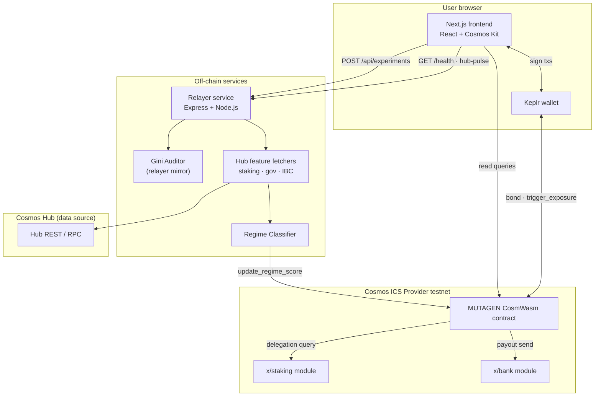
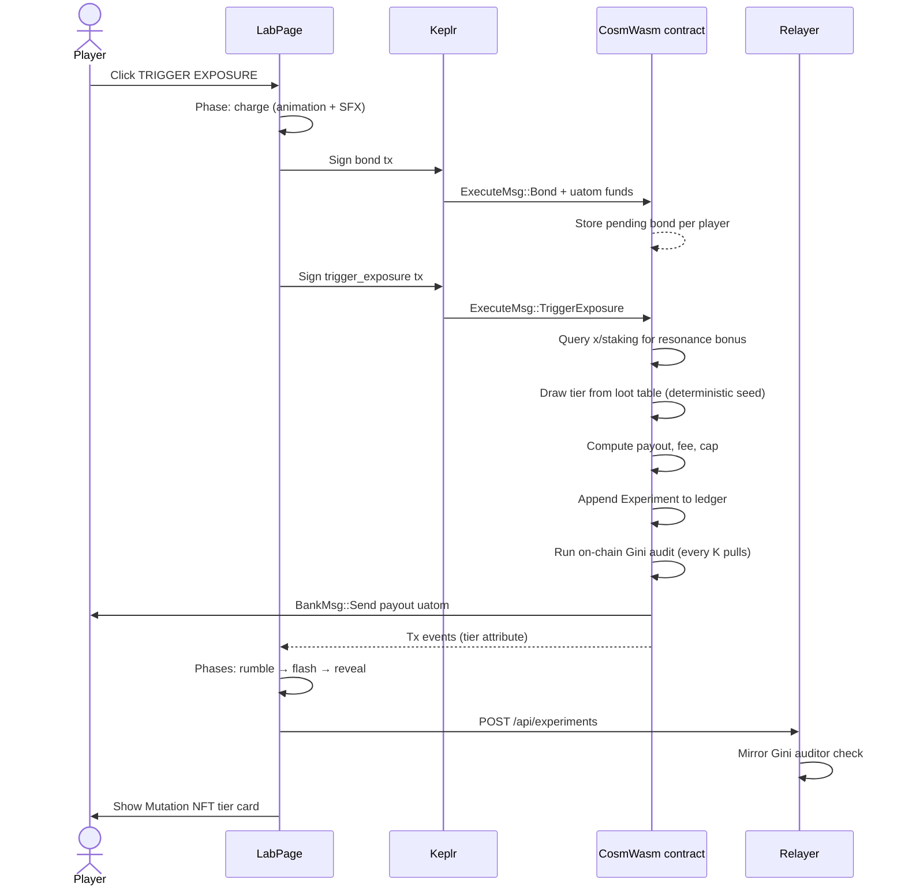
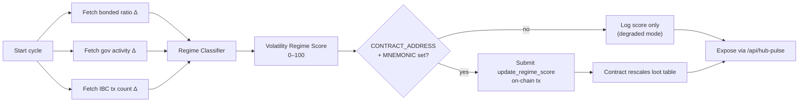
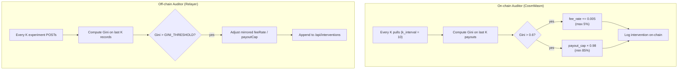
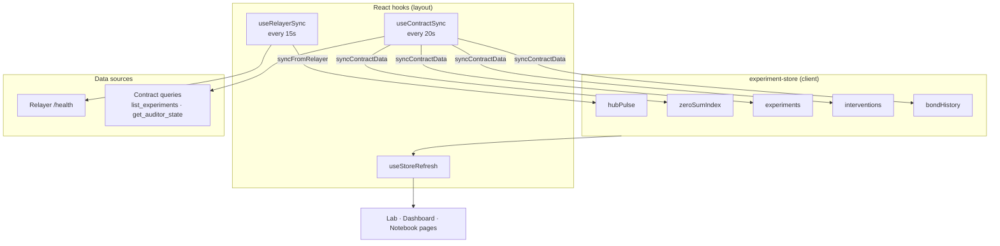
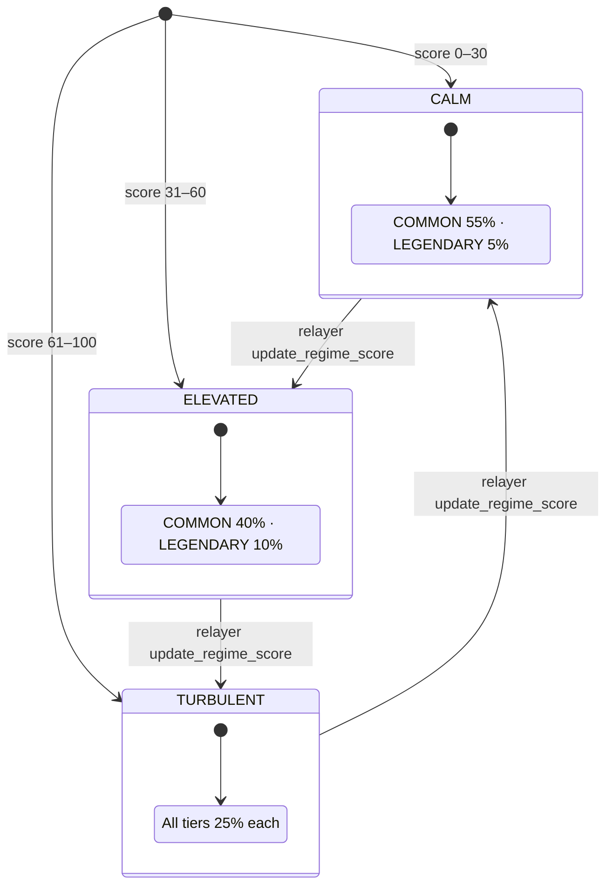
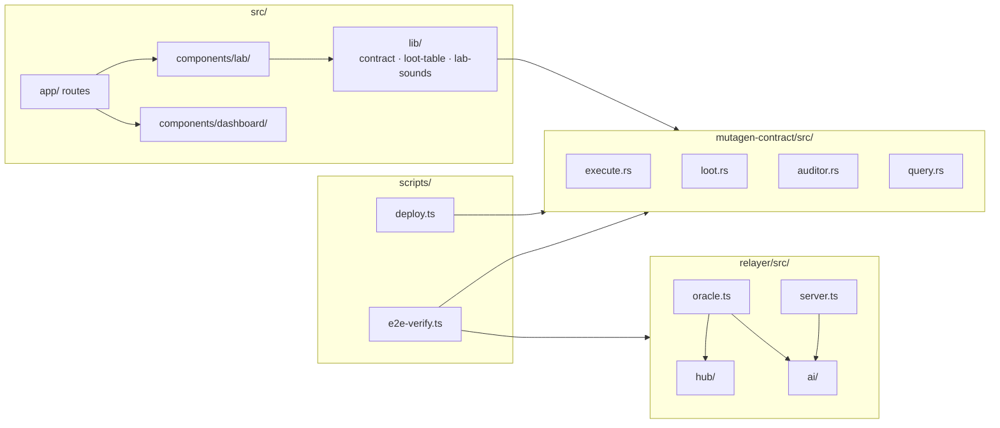
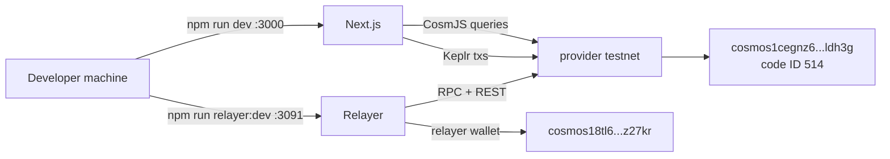

# MUTAGEN — Architecture Diagrams

This file contains all Mermaid diagrams referenced from [README.md](./README.md).  
GitHub, GitLab, and many Markdown viewers render these blocks natively.

---

## 1. System overview

High-level view of every runtime component and how they connect.



---

## 2. Mutagen Exposure pull sequence

End-to-end flow when a player triggers a pull in **The Lab**.



---

## 3. Oracle cycle (Regime Classifier)

Runs on an interval (`INTERVAL_MS`, default 5 minutes) inside the relayer.



**Score formula (simplified):**

```text
score = min(100, round(bonded_contrib + gov_contrib + ibc_contrib))
each contrib = min(33, normalizeDelta(feature) × 33.33)
```

| Score range | Regime label | Loot table behavior        |
|-------------|--------------|----------------------------|
| 0–30        | CALM         | Tighter distribution       |
| 31–60       | ELEVATED     | Balanced shift             |
| 61–100      | TURBULENT    | Flattened odds, higher mult |

---

## 4. Dual auditor model

MUTAGEN runs fairness checks in **two places** — mirroring Odin Scan’s “continuous audit” pattern for economic risk instead of code risk.



---

## 5. Frontend data synchronization

How live dashboard and lab odds stay updated.



---

## 6. Loot table state machine

How regime score reshapes tier weights.



Resonance bonus (on-chain: Hub staker with ≥ 1 ATOM delegated) shifts weight from COMMON toward higher tiers before the draw.

---

## 7. Repository module map



---

## 8. Lab animation phases

Visual and audio timeline during a pull (when reduced motion is off).

```mermaid
gantt
    title Mutagen Exposure animation timeline
    dateFormat X
    axisFormat %Ls

    section Visual
    Charge (rings, bubbles, scanlines) :active, c1, 0, 3000
    Rumble (machine shake)               :active, c2, 3000, 700
    Flash (white burst + particles)      :crit, c3, 3700, 450
    Reveal (tier card pop)               :done, c4, 4150, 700

    section Audio
    Soft charge hum                      :a1, 0, 3000
    Rumble noise                         :a2, 3000, 250
    Flash square burst                   :a3, 3700, 300
    Tier arpeggio reveal                 :a4, 4150, 500
```



> Timing overlaps with wallet signing — charge audio starts on button click and fades when rumble begins.

---

## 9. Deployment topology (current testnet)



See `public/contract.json` for the canonical deployment manifest.
